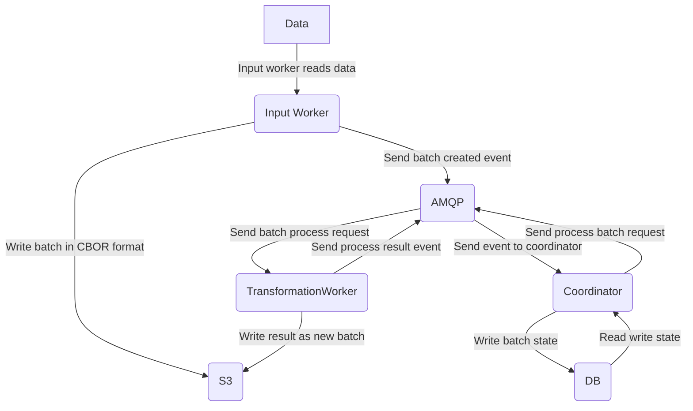

# STARBYTE: Cloud-Native ETL Data Pipeline Framework

### Proof of Concept - Work in Progress

The STARBYTE project aims to develop an open and extensible tool for constructing data pipelines, free from the constraints of any single technology or stack.

### Proposed Approach:

Our approach allows for flexibility in technology choices. Workers can be built using any technology, provided they adhere to the following limitations:
- Workers must read CBOR files from S3.
- Workers must write the processed results as CBOR files to S3.

This design enables the creation of a chain of workers, facilitating data exchange through S3-like storage. Additionally, workers can be hosted in Kubernetes, auto-scaled, and more.

## Architecture:
